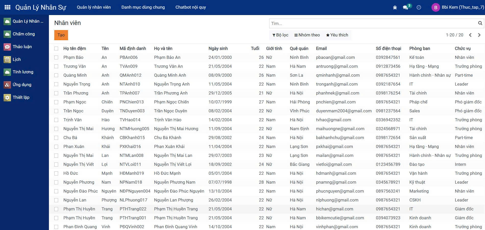
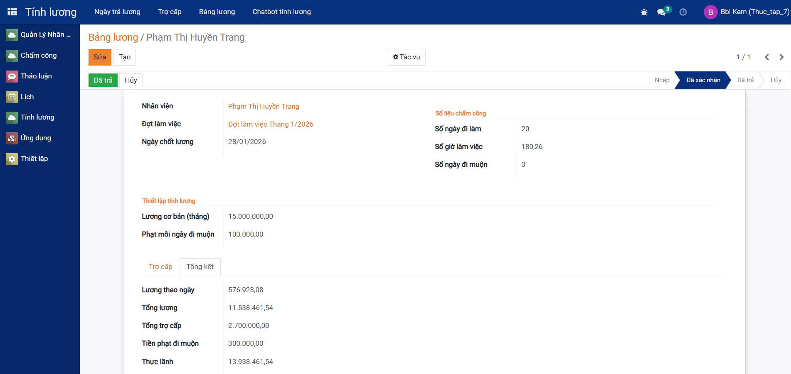
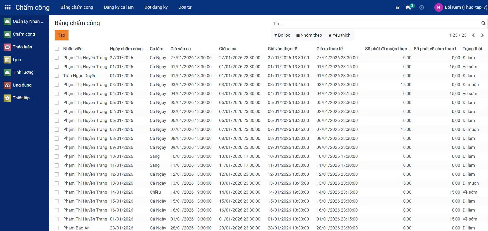
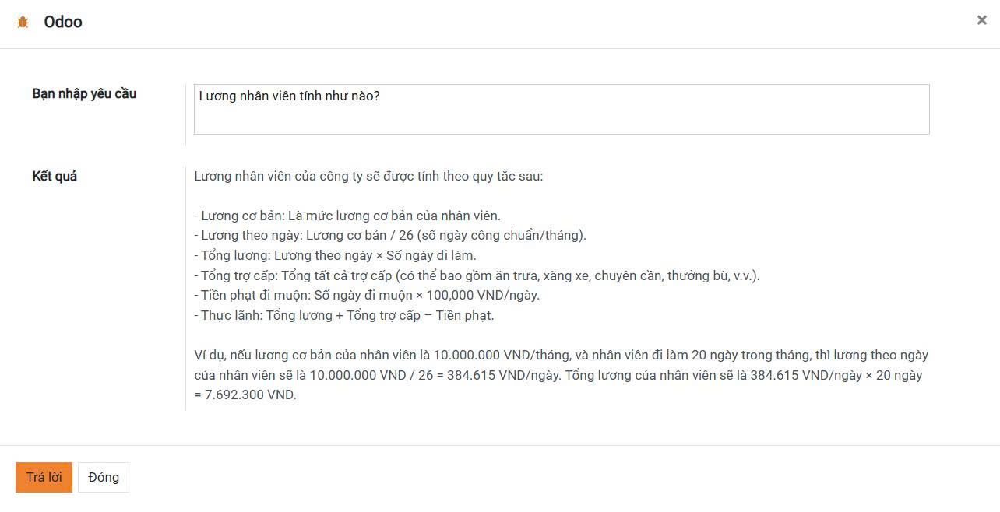
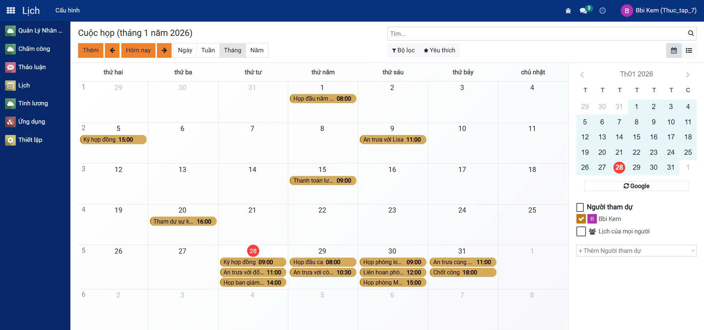

<h2 align="center">
    <a href="https://dainam.edu.vn/vi/khoa-cong-nghe-thong-tin">
    🎓 Faculty of Information Technology (DaiNam University)
    </a>
</h2>
<h2 align="center">
    Hệ Thống Quản Lý Nhân Sự kết hợp Chấm Công và Tính Lương<br/>
    <small>HR, Attendance & Payroll Management System with AI Chatbot</small>
</h2>
<div align="center">
    <p align="center">
        
        
        
    </p>


[](https://www.facebook.com/DNUAIoTLab)
[](https://dainam.edu.vn/vi/khoa-cong-nghe-thong-tin)
[](https://dainam.edu.vn)

</div>
 
## 📖 1. Giới thiệu

Hệ thống **Quản lý Nhân Sự, Chấm Công, Tính Lương với Chatbot AI** được xây dựng trên nền tảng **Odoo 17**, tối ưu hóa toàn bộ quy trình nhân sự của doanh nghiệp.

<div align="center">

📸 **Giao diện hệ thống**

<p>
    
    
</p>

</div>

<br/>

### 🎯 Lợi ích chính:
- ✅ Tự động hóa 100% quy trình quản lý nhân sự
- ✅ Loại bỏ các tệp Excel rời rạc, xử lý thủ công
- ✅ Chatbot AI hỗ trợ nhân viên 24/7 (Groq API)
- ✅ Báo cáo thực thời, dashboard trực quan
- ✅ Tích hợp sâu, dữ liệu đồng bộ

### 📌 4 Module Cốt Lõi:
1. **Quản lý Nhân Sự (HR)** - Thông tin nhân viên, hợp đồng, cấu trúc
2. **Chấm Công (Attendance)** - Theo dõi giờ làm, đi/về, làm việc từ xa
3. **Tính Lương (Payroll)** - Lương tự động, phụ cấp, khấu trừ, BHXH
4. **Chatbot Lương (AI)** - Query lương, phụ cấp, sao kê qua chat

## 🎨 2. Các Tính Năng Chi Tiết

### 1️⃣ Quản lý Nhân Sự (HR Module) 👥
**Quản lý toàn bộ thông tin nhân viên và cấu trúc tổ chức**

<div align="center">
    
</div>

<br/>

<div align="center">

| Tính năng | Mô tả |
|-----------|-------|
| 📋 Hồ sơ nhân viên | Thông tin cá nhân, liên lạc, hộ khẩu, giấy tờ |
| 🏢 Quản lý phòng ban | Tạo, chỉnh sửa phòng ban, quản lý cấu trúc |
| 🎯 Quản lý chức vụ | Khai báo chức vụ, mô tả công việc, lương theo chức vụ |
| 📜 Hợp đồng lao động | Tạo, theo dõi, quản lý hợp đồng, gia hạn |
| 🎓 Kỹ năng & Đào tạo | Quản lý kỹ năng, khóa đào tạo, phát triển nhân sự |
| 📊 Sơ đồ tổ chức | Biểu đồ cấu trúc công ty, quan hệ cấp bậc |
| 🔄 Chuyển công tác | Thay đổi phòng ban, chức vụ, lương |

</div>

### 2️⃣ Chấm Công & Giờ Làm Việc (Attendance Module) ⏱️
**Theo dõi thời gian làm việc, đi/về, làm việc từ xa**

<div align="center">
    
</div>

<br/>

<div align="center">

| Tính năng | Mô tả |
|-----------|-------|
| 🕐 Chấm công thực thời | Check-in/out qua web, mobile, máy chấm công |
| 📊 Báo cáo giờ làm | Tính giờ làm, giờ tăng ca, giờ ngoài |
| 🏠 Làm việc từ xa | Đánh dấu WFH, quản lý linh hoạt |
| ⚠️ Cảnh báo | Cảnh báo muộn, sớm, vắng mặt tự động |
| 📅 Lịch công tác | Xếp lịch ca làm việc, công tác |
| 🔍 Quản lý ngoài giờ | Tính tăng ca, giờ đêm, điều chỉnh |
| 📈 Phân tích chấm công | Báo cáo xu hướng, thống kê, heatmap |

</div>

### 3️⃣ Tính Lương Tự Động (Payroll Module) 💰
**Tính toán lương, phụ cấp, khấu trừ, BHXH tự động**

<div align="center">
    
</div>

<br/>

<div align="center">

| Tính năng | Mô tả |
|-----------|-------|
| 🧮 Công thức lương | Tạo quy tắc tính lương linh hoạt |
| 💵 Thành phần lương | Lương cơ bản, thưởng, phụ cấp, vượt chi chỉ tiêu |
| 📉 Khấu trừ | BHXH, BHYT, BHTN, tạm ứng, vay vốn |
| 🔄 Tính toán tự động | Tích hợp dữ liệu chấm công, nghỉ phép |
| 📊 Bảng lương | Xuất Excel, PDF, gửi email đến nhân viên |
| 💳 Sao kê cá nhân | Nhân viên xem chi tiết lương, phụ cấp, khấu trừ |
| ✅ Phê duyệt lương | Quy trình phê duyệt, lịch sử thay đổi |
| 📈 Báo cáo lương | Báo cáo tháng, quý, năm, so sánh |
| 🏦 Quản lý BHXH | Khai báo, tính BHXH, BHYT, BHTN |

</div>

### 4️⃣ Chatbot Tính Lương (AI Assistant) 🤖
**Hỗ trợ nhân viên query lương, phụ cấp 24/7 qua chat**

<div align="center">
    
</div>

<br/>

### 5️⃣ Lịch Cuộc Họp (Calendar) 🗓️
**Quản lý lịch họp, lịch làm việc của nhân viên và phòng ban**

<div align="center">
    
</div>

<br/>

<div align="center">

| Tính năng | Mô tả |
|-----------|-------|
| 💬 Chat interface | Giao diện chat trực quan, dễ sử dụng |
| 📝 Query lương | "Lương tháng này bao nhiêu?", "Phụ cấp là gì?" |
| 🧠 Groq AI | Sử dụng Groq API cho xử lý nhanh, chính xác |
| 📚 Knowledge base | Quy tắc tính lương từ file Markdown |
| 🔐 Bảo mật dữ liệu | Chỉ nhân viên xem dữ liệu của mình |
| 🌍 Đa ngôn ngữ | Hỗ trợ tiếng Việt, English |
| ⚡ Phản hồi nhanh | Trả lời ngay lập tức, không cần chờ |

</div>

## 🛠️ 3. Công Nghệ & Công Cụ

<div align="center">

### Backend & Database
[](https://www.python.org/)
[](https://www.odoo.com/)
[](https://www.postgresql.org/)

### AI & Machine Learning
[](https://groq.com/)

### Frontend
[](#)
[](#)
[](#)

### DevOps & Deployment
[](https://www.docker.com/)
[](https://docs.docker.com/compose/)
[](https://git-scm.com/)

### Operating Systems


</div>

## ⚙️ 4. Cài Đặt & Chạy Hệ Thống

### 📋 4.1 Yêu Cầu Hệ Thống
- **Python 3.10+**
- **PostgreSQL 12+**
- **Docker & Docker Compose** (khuyến nghị)
- **Git**
- **RAM: 4GB+**, **Disk: 10GB+**
- **Groq API Key** (cho Chatbot)

### 🐳 4.2 Cài Đặt Nhanh với Docker (Khuyến nghị)

```bash
# 1. Clone project
git clone https://github.com/your-repo/odoo-fitdnu.git
cd odoo-fitdnu

# 2. Khởi động
docker-compose up -d

# 3. Truy cập tại http://localhost:8069
# Username: admin
# Password: admin
```

### 🖥️ 4.3 Cài Đặt Trên Linux (Ubuntu/Debian)

```bash
# 1. Cập nhật hệ thống
sudo apt update && sudo apt upgrade -y

# 2. Cài đặt dependencies
sudo apt install -y python3 python3-pip python3-dev postgresql postgresql-contrib \
    git libxml2-dev libxslt1-dev libzip-dev libsasl2-dev libssl-dev libffi-dev

# 3. Clone project
cd /opt
sudo git clone https://github.com/your-repo/odoo-fitdnu.git
cd odoo-fitdnu

# 4. Virtual environment
python3 -m venv venv
source venv/bin/activate

# 5. Install Python packages
pip install -r requirements.txt

# 6. Cấu hình Database PostgreSQL
sudo -u postgres createdb odoo_db
sudo -u postgres createuser -P odoo_user

# 7. Cấu hình Odoo
cp odoo.conf.template odoo.conf
# Sửa file odoo.conf: db_name, db_user, db_password

# 8. Chạy Odoo
./odoo-bin -c odoo.conf
# Hoặc: python3 odoo-bin.py -c odoo.conf

# 9. Truy cập: http://localhost:8069
```

### 🪟 4.4 Cài Đặt Trên Windows

```bash
# 1. Tải Python 3.10+ từ https://www.python.org/downloads/
# 2. Tải PostgreSQL từ https://www.postgresql.org/download/windows/

# 3. Clone project
git clone https://github.com/your-repo/odoo-fitdnu.git
cd odoo-fitdnu

# 4. Virtual environment
python -m venv venv
venv\Scripts\activate

# 5. Install dependencies
pip install -r requirements.txt

# 6. Chạy Odoo
python odoo-bin.py -c odoo.conf

# 7. Truy cập: http://localhost:8069
```

## 📚 5. Hướng Dẫn Sử Dụng

### 5.1 Module Quản Lý Nhân Sự (HR)
```
Menu: HR → Employees
Chức năng:
- Quản lý thông tin nhân viên (cá nhân, liên lạc, hộ khẩu)
- Tạo phòng ban, chức vụ
- Tạo hợp đồng lao động
- Xem sơ đồ tổ chức công ty
- Quản lý kỹ năng, đào tạo
```

### 5.2 Module Chấm Công (Attendance)
```
Menu: HR → Attendance
Chức năng:
- Check-in/out thực thời
- Xem báo cáo giờ làm chi tiết
- Quản lý lịch ca làm việc
- Báo cáo chấm công tháng, quý, năm
- Cảnh báo muộn, sớm, vắng mặt
```

### 5.3 Module Tính Lương (Payroll)
```
Menu: HR → Payroll
Chức năng:
- Tạo quy tắc tính lương
- Tạo bảng lương hàng tháng
- Tính toán tự động từ chấm công + nghỉ phép
- Xuất bảng lương Excel, PDF
- Gửi sao kê lương đến nhân viên
- Phê duyệt lương
- Báo cáo lương chi tiết
```

### 5.4 Module Chatbot Tính Lương (AI)
```
Menu: HR → Payroll → Chatbot
Chức năng:
- Chat hỏi thông tin lương: "Lương tháng này bao nhiêu?"
- Query phụ cấp: "Phụ cấp quán lý là gì?"
- Sao kê lương cá nhân
- Giải thích quy tắc tính lương
- Tích hợp Groq API cho xử lý AI nhanh
Cấu hình:
- Đi tới: Settings → Groq API Key
- Nhập Groq API Key của bạn
```

## 🎨 6. Các Tính Năng Nổi Bật

### ⚡ Tự Động Hóa Thông Minh
```
Chấm Công → Tính Lương
- Tự động nhập liệu giờ làm từ check-in
- Áp dụng quy tắc tính lương cấu hình sẵn
- Tối ưu nhất công sức, giảm sai sót
```

### 🤖 Chatbot AI Thông Minh
```
- Hiểu tự nhiên tiếng Việt
- Trích xuất dữ liệu lương từ database
- Giải thích quy tắc tính lương phức tạp
- Phản hồi trong vòng < 1 giây
- Bảo mật: Chỉ nhân viên xem dữ liệu của họ
```

### 📊 Báo Cáo Thực Thời
```
- Dashboard tổng quan toàn công ty
- Báo cáo chấm công, lương theo người
- Export Excel, PDF với format chuyên nghiệp
- Biểu đồ, thống kê trực quan
```

### 🔒 Bảo Mật & Quyền Hạn
```
- Phân quyền chi tiết (Nhân viên, Quản lý, Kế toán, Admin)
- Mã hóa dữ liệu nhạy cảm
- Lịch sử thay đổi, audit log
- HTTPS/SSL cho truyền tải
```

## 💡 7. Use Cases & Ví Dụ

### 📌 Quy Trình Tính Lương Tiêu Chuẩn
```
1. Nhân viên check-in/out → Hệ thống ghi giờ làm
2. Tháng kết thúc → Tự động tính lương từ công thức
3. Kế toán review, phê duyệt
4. Chatbot giải đáp thắc mắc nhân viên
5. Xuất bảng lương, gửi sao kê
```

### 📌 Chatbot Hỗ Trợ Nhân Viên
```
Nhân viên: "Lương tháng 12 của tôi là bao nhiêu?"
Chatbot: "Lương cơ bản 10 triệu + phụ cấp 1 triệu = 11 triệu
         Khấu trừ: BHXH 500K + Tạm ứng 1 triệu = 1.5 triệu
         Lương thực nhận: 9.5 triệu
         Chi tiết: [link sao kê]"

Nhân viên: "Phụ cấp quản lý là gì?"
Chatbot: "Phụ cấp quản lý: 500 ngàn/tháng
         Điều kiện: Chức vụ quản lý trở lên
         Áp dụng từ tháng 01/2024
         Bạn hiện được hưởng: [Có/Không]"
```

## 📞 8. Support & Liên Hệ

- 📧 Email: [bbikemcutie@gmail.com]
- 🌐 Website: [https://dainam.edu.vn]
- 💬 Issues: GitHub Issues

## 📄 9. License & Attribution

- **License**: [MIT/GPL/Commercial]
- **Developed by**: NgocDuyen-MaiHuong-HuyenTrang, Faculty of Information Technology, DaiNam University
- **Built with**: [Odoo](https://odoo.com), [Groq](https://groq.com)
- **Reference source**: [TTDN-15-01-N5](https://github.com/dinhtuananh188/TTDN-15-01-N5) - Chấm công

## 🙏 10. Đóng Góp

Chúng tôi chào đón các đóng góp từ cộng đồng!

```bash
# 1. Fork project
# 2. Tạo branch feature: git checkout -b feature/YourFeature
# 3. Commit: git commit -m 'Add YourFeature'
# 4. Push: git push origin feature/YourFeature
# 5. Tạo Pull Request
```

Xem thêm: [CONTRIBUTING.md](CONTRIBUTING.md)

---

<div align="center">

⭐ Nếu bạn thích project này, hãy star nó! ⭐

Made with ❤️ by DuynTran, MaiHuong, HuyenTrang

</div>
