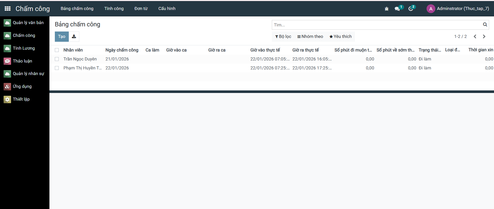
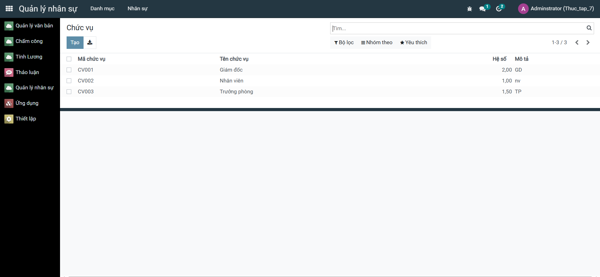
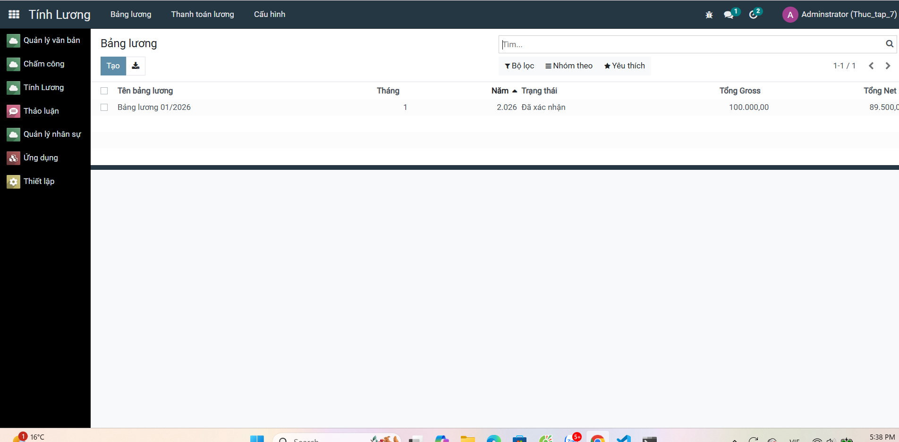

<h2 align="center">
    <a href="https://dainam.edu.vn/vi/khoa-cong-nghe-thong-tin">
    🎓 Faculty of Information Technology (DaiNam University)
    </a>
</h2>
<h2 align="center">
    Hệ Thống Quản Lý Nhân Sự, Chấm Công và Tính Lương<br/>
    <small>Human Resources, Attendance & Payroll Management System</small>
</h2>
<div align="center">
    <p align="center">
        
        
        
    </p>

[](https://www.facebook.com/DNUAIoTLab)
[](https://dainam.edu.vn/vi/khoa-cong-nghe-thong-tin)
[](https://dainam.edu.vn)

</div>
 
## 📖 1. Giới thiệu
Hệ thống Quản lý Nhân Sự, Chấm Công và Tính Lương được xây dựng dựa trên nền tảng **Odoo**, nhằm hỗ trợ các doanh nghiệp và tổ chức trong việc quản lý toàn diện về nhân sự. Hệ thống cung cấp các tính năng:

- **Quản lý Nhân Sự (HR)**: Quản lý thông tin nhân viên, hợp đồng lao động, phòng ban, chức vụ
- **Chấm Công (Attendance)**: Theo dõi thời gian tham gia công việc, giờ làm việc, nghỉ phép
- **Tính Lương (Payroll)**: Tính toán lương, thưởng, phụ cấp, khấu trừ và xuất bảng lương chi tiết

Thay vì sử dụng các tệp Excel rời rạc hay hệ thống thủ công, giải pháp này mang lại một nền tảng tập trung, hiện đại, tự động hóa và dễ sử dụng cho toàn bộ quy trình quản lý nhân sự.

## 🔧 2. Các công nghệ được sử dụng
<div align="center">

### Nền Tảng Chính
[](https://www.odoo.com/)
[](https://www.python.org/)

### Công nghệ Backend
[](https://www.postgresql.org/)
[](#)

### Công nghệ Frontend
[](#)
[](#)
[](#)

### Hệ điều hành


### Công cụ & Deployment
[](https://www.docker.com/)
[](https://docs.docker.com/compose/)
[](https://git-scm.com/)
</div>

## 🚀 3. Các tính năng chính

### ✨ Quản lý Nhân Sự (HR Module)
- 👥 Quản lý thông tin nhân viên chi tiết (cá nhân, liên lạc, hợp đồng)
- 🏢 Tổ chức cấu trúc công ty (phòng ban, chức vụ, quản lý cấp bậc)
- 📋 Quản lý hợp đồng lao động và tuyển dụng
- 🎓 Quản lý kỹ năng, đào tạo và phát triển nhân sự
- 📊 Biểu đồ tổ chức và sơ đồ cấu trúc công ty

### ⏱️ Chấm Công & Đi/Về (Attendance Module)
- 🕐 Theo dõi thời gian tham gia công việc chi tiết
- 📱 Hỗ trợ chấm công qua máy chủ hoặc thiết bị mobile
- 🏠 Quản lý làm việc từ xa
- 📅 Lịch công tác và lập kế hoạch công việc
- ⚠️ Cảnh báo khi muộn, sớm về hoặc vắng mặt

### 💰 Tính Lương (Payroll Module)
- 🧮 Tính toán lương tự động theo công thức cấu hình
- 💳 Quản lý các khoản lương, thưởng, phụ cấp, khấu trừ
- 📊 Xuất bảng lương chi tiết, sao kê lương cá nhân
- 🏦 Quản lý khoản vay, bảo hiểm xã hội (BHXH, BHYT, BHTN)
- 📈 Báo cáo lương theo tháng, quý, năm
- ✅ Phê duyệt lương và quy trình công khai

### 🕖 Nghỉ Phép & Thời Gian Off (Leaves Module)
- 📅 Quản lý các loại nghỉ phép (phép năm, phép ốm, phép không lương, ...)
- 🔄 Quy trình yêu cầu và phê duyệt nghỉ phép
- 📊 Báo cáo số ngày nghỉ, ngày còn lại
- ⏰ Hỗ trợ tính lương tự động khi có nghỉ phép

### 📊 Báo Cáo & Phân Tích
- 📈 Báo cáo chi tiết về nhân sự, chấm công, lương
- 📉 Phân tích xu hướng, thống kê, dự báo
- 🎯 Bảng điều khiển (Dashboard) tổng hợp thông tin chính
- 📄 Xuất báo cáo sang Excel, PDF

## 📸 3.1. Giao diện chính của hệ thống

### Quản lý Nhân Sự


### Quản lý Chức Vụ


### Tính Lương


## ⚙️ 4. Cài đặt và Chạy Hệ Thống

### 4.1. Yêu cầu hệ thống

- **Python 3.10+** 
- **PostgreSQL 12+**
- **Docker & Docker Compose** (khuyến nghị)
- **Git**
- **Ít nhất 4GB RAM**, 10GB dung lượng ổ cứng

### 4.2. Cài đặt sử dụng Docker (Khuyến nghị)

**Bước 1**: Clone project
```bash
git clone https://github.com/your-repo/odoo-fitdnu.git
cd odoo-fitdnu
```

**Bước 2**: Tạo file environment
```bash
cp .env.example .env
```

**Bước 3**: Khởi động hệ thống với Docker Compose
```bash
docker-compose up -d
```

**Bước 4**: Truy cập Odoo
- Mở trình duyệt: `http://localhost:8069`
- Tài khoản mặc định: `admin` / `admin`

### 4.3. Cài đặt trên máy chủ Linux (Ubuntu/Debian)

**Bước 1**: Cập nhật hệ thống
```bash
sudo apt update && sudo apt upgrade -y
```

**Bước 2**: Cài đặt các gói phụ thuộc
```bash
sudo apt install -y python3 python3-pip python3-dev postgresql postgresql-contrib \
    git libxml2-dev libxslt1-dev libzip-dev libsasl2-dev libssl-dev libffi-dev \
    libjpeg-dev zlib1g-dev
```

**Bước 3**: Clone project
```bash
cd /opt
sudo git clone https://github.com/your-repo/odoo-fitdnu.git
cd odoo-fitdnu
```

**Bước 4**: Tạo virtual environment
```bash
python3 -m venv venv
source venv/bin/activate
```

**Bước 5**: Cài đặt các dependency
```bash
pip install --upgrade pip
pip install -r requirements.txt
```

**Bước 6**: Cấu hình database PostgreSQL
```bash
sudo -u postgres createdb odoo_db
sudo -u postgres createuser -P odoo_user
# Nhập mật khẩu khi được yêu cầu
```

**Bước 7**: Chỉnh sửa file cấu hình
```bash
cp odoo.conf.template odoo.conf
# Sửa file odoo.conf:
# - db_name = odoo_db
# - db_user = odoo_user
# - db_password = <password>
```

**Bước 8**: Khởi chạy Odoo
```bash
./odoo-bin -c odoo.conf
# Hoặc sử dụng Python
python3 odoo-bin.py -c odoo.conf
```

**Bước 9**: Truy cập Odoo
- Mở trình duyệt: `http://localhost:8069`
- Tài khoản mặc định: `admin` / `admin`

### 4.4. Cài đặt trên Windows

**Bước 1**: Cài đặt Python 3.10+
- Tải từ https://www.python.org/downloads/
- Chọn "Add Python to PATH"

**Bước 2**: Cài đặt PostgreSQL
- Tải từ https://www.postgresql.org/download/windows/
- Ghi nhớ username và mật khẩu

**Bước 3**: Clone project
```bash
git clone https://github.com/your-repo/odoo-fitdnu.git
cd odoo-fitdnu
```

**Bước 4**: Tạo virtual environment
```bash
python -m venv venv
venv\Scripts\activate
```

**Bước 5**: Cài đặt dependencies
```bash
pip install --upgrade pip
pip install -r requirements.txt
```

**Bước 6**: Chạy Odoo
```bash
python odoo-bin.py -c odoo.conf
```

## 📚 5. Cấu hình các Module chính

### 5.1. Module Nhân Sự (HR)
- Đi tới: Settings → Employees → Employees
- Thêm thông tin nhân viên, phòng ban, chức vụ

### 5.2. Module Chấm Công (Attendance)
- Đi tới: HR → Attendance → Check-in
- Cấu hình dữ liệu chấm công

### 5.3. Module Tính Lương (Payroll)
- Đi tới: HR → Payroll → Salary Rules
- Tạo các quy tắc tính lương, loại phụ cấp, khấu trừ

### 5.4. Module Nghỉ Phép (Leaves)
- Đi tới: HR → Leaves → Leave Types
- Cấu hình các loại nghỉ phép và số ngày hưởng


    
